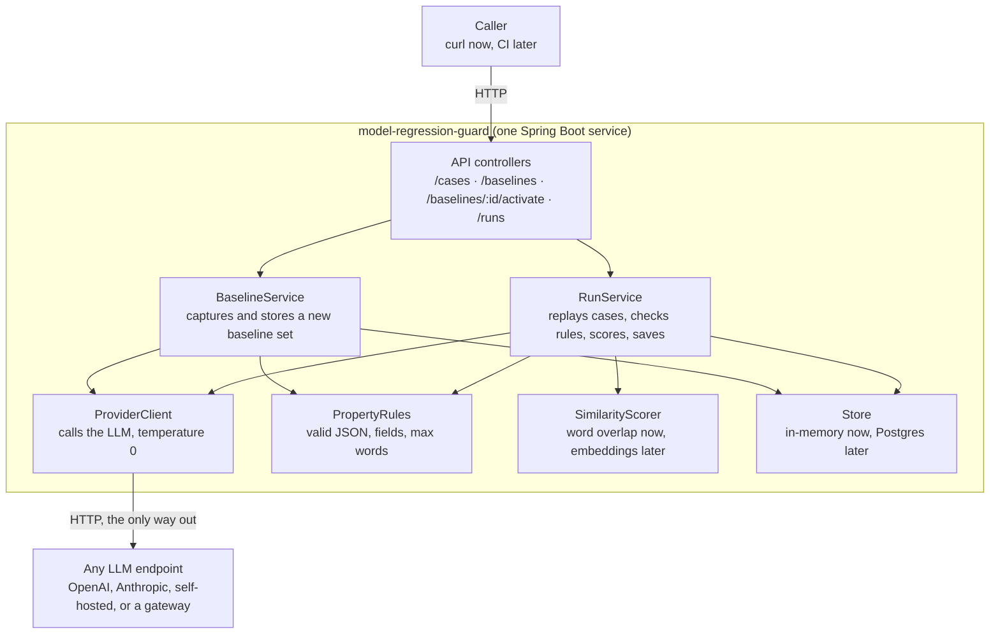
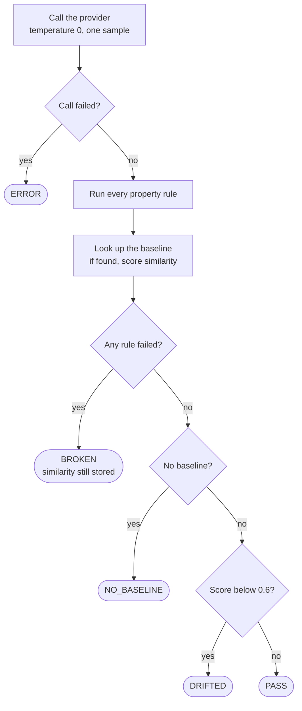

# model-regression-guard

Catches it when an LLM provider silently changes how its model behaves.

You register a golden set of prompts, capture what the model says when things are good, and replay the same prompts later. Each case comes back as **PASS**, **DRIFTED**, **BROKEN**, **NO_BASELINE** or **ERROR**, and the run as a whole as **PASSED**, **WARNING**, **FAILED** or **INCONCLUSIVE**.

> **Status:** slice 1 of 6. Domain model and the similarity scorer are built and tested. No HTTP endpoints yet. See [Roadmap](#roadmap).

## Why this exists

Providers change model behaviour behind version aliases, force upgrades, and don't reliably support version pinning. Your tests pass, your dashboards are green, and the outputs quietly get worse.

I hit this while building an [LLM inference gateway](https://github.com/shreyaannshh) with cross-provider failover and caching. Failover looked healthy. The answers coming back had drifted. Nothing in the stack could tell the difference between "the provider is up" and "the provider is still giving the same answers".

This tool answers the second question. It works against any OpenAI-compatible endpoint: OpenAI, Anthropic, a self-hosted model, or a gateway. It shares no code with the gateway; if it targets one, it calls it over HTTP like any other client.

## How it works

1. **Register golden cases.** Each case is a prompt plus optional property rules, such as "must be valid JSON" or "under 200 words".
2. **Capture a baseline set.** The tool sends every prompt at temperature 0 and stores the responses as the known-good reference. Capturing never overwrites: each capture is a new, versioned set.
3. **Activate it.** A new set is not trusted until you activate it explicitly.
4. **Run.** The tool replays every case, checks its rules, scores its similarity to the active baseline, and saves the result. Every run records which baseline set it was judged against, so old runs stay readable after you re-baseline.

The design deliberately keeps two questions apart:

- **Is the output broken?** Deterministic property rules. Unambiguous. A failure is **BROKEN**.
- **Has the output changed?** Similarity to the baseline. A low score is **DRIFTED**: behaviour moved, without claiming it got worse.

A tool that reports "broken" and "changed" as the same thing is noisy, and a noisy tool gets switched off.

## Architecture



Only `ProviderClient` talks to the outside world. Pointing the tool at a different provider is a config change, not a code change.

## Verdict rules

Every case gets exactly one verdict. The checks run in a fixed order and the first match wins.



- **BROKEN outranks NO_BASELINE**, so a new case that returns invalid output says so instead of hiding behind "no baseline yet".
- **Similarity is computed for BROKEN cases too**, and stored, but it does not decide their verdict.
- **The drift score** is the mean similarity over cases whose verdict is PASS or DRIFTED. If none qualify it is `null`, not `0`, because `0` would read as "everything drifted".
- **`comparedCount`** is the number of cases actually compared against a baseline (PASS or DRIFTED). Partial coverage is visible instead of implied.

### Run status

| Status | When |
| --- | --- |
| FAILED | Any case is BROKEN or ERROR |
| INCONCLUSIVE | Zero cases were compared. A run that compared nothing cannot be green |
| WARNING | Any case is DRIFTED, and none failed |
| PASSED | Otherwise |

DRIFTED warns rather than fails on purpose. It rests on a threshold that is a placeholder (see below). Making an untuned number a build-breaker is how this kind of tool gets switched off in week two. Once Phase 2 replaces the threshold with per-case noise floors, promoting DRIFTED to a failure becomes defensible.

## API (Phase 1)

| Method | Path | What it does |
| --- | --- | --- |
| POST | `/cases` | Register a golden case |
| GET | `/cases` | List golden cases |
| POST | `/baselines` | Capture a new baseline set. Never overwrites. Cases whose response fails their own rules are skipped, and the response lists every skipped case id and why |
| POST | `/baselines/{id}/activate` | Make a captured set the reference for future runs |
| POST | `/runs` | Replay every case against the active set, score, save. Returns `409` if no set is active |
| GET | `/runs/{id}` | Read a past run |

## Domain model

| Type | Holds |
| --- | --- |
| `GoldenCase` | `id`, `prompt`, `propertyRules`, `createdAt` |
| `BaselineSet` | `id`, `createdAt`, `modelRequested`, one `Baseline` per case |
| `Baseline` | `caseId`, `response`, `capturedAt`, `modelReported` |
| `Run` | `id`, `startedAt`, `finishedAt`, `baselineSetId`, `modelRequested`, `caseResults`, `driftScore`, `comparedCount`, `status` |
| `CaseResult` | `caseId`, `response`, `modelReported`, `ruleResults`, `similarity`, `verdict` |

The store keeps a single `activeBaselineSetId` pointer rather than an `active` flag on each set, so "exactly one active set" is guaranteed by the shape of the data.

`modelRequested` and `modelReported` are both kept, because providers often resolve an alias to a dated model. A change in the reported name is a signal worth showing. A matching name is never proof of no drift: the whole premise is that behaviour changes behind an unchanged name.

## Scoring

Phase 1 uses word-set overlap (Jaccard similarity):

1. Lowercase the text using a fixed locale.
2. Treat every character that is not a letter or digit as a separator.
3. Collect the words into a set.
4. Score = words in both ÷ distinct words across both.
5. Both empty → `1.0`. Exactly one empty → `0.0`.

It is cheap, needs no extra API, and runs offline. Phase 2 swaps in embedding similarity behind the same `SimilarityScorer` interface. Each scorer carries its own threshold, because `0.6` word overlap and `0.6` embedding cosine are not the same claim.

The drift threshold is set in `application.yml` as `scoring.word-overlap.drift-threshold`. **The default of 0.6 is a placeholder, not a tuned value.** It is deliberately loose: it under-alarms rather than cries wolf, and the raw score is always reported for a human to read.

## Design decisions

| Decision | Reason |
| --- | --- |
| Regression against a captured baseline, not evaluation against hand-written expectations | The problem is change over time |
| Two verdict layers: rules (BROKEN) and similarity (DRIFTED) | Mixing "broken" and "changed" makes a noisy tool |
| Versioned baseline sets, never overwritten; each run stores `baselineSetId` | Re-baselining is normal. Without this, every past run loses its meaning the first time it happens |
| Explicit activation of a new set | Auto-activation would let a bad capture silently become the reference |
| A baseline response that fails its own rules is skipped, not stored, and the skip is reported | One flaky prompt must not block a capture, and silent partial success hides that you have 17 baselines, not 20 |
| ERROR is its own verdict, excluded from the drift score, counted in the run summary | A timeout is a fact about the network, not the model |
| INCONCLUSIVE status and `comparedCount` | Never report more confidence than you have |
| Temperature 0, one sample per case | Simplest honest starting point; the residual noise is documented below |

## Open decisions

- **Does one ERROR fail the whole run?** Today, yes. But a single network blip then turns a 20-case run red, the same risk that keeps DRIFTED from failing runs. The alternative is to fail only above an ERROR rate.
- **FAILED or INCONCLUSIVE when every case errors?** As written, FAILED is checked first.

## Known limitations

- Hosted providers are not fully deterministic even at temperature 0. With one sample per case, some normal variation reaches the score.
- The 0.6 threshold is a placeholder, not tuned against real data.
- For JSON responses, field names appear in both versions and inflate the word-overlap score.
- `POST /runs` is synchronous. It will time out once the case count grows.

## Roadmap

**Phase 1, built in slices**

- [x] 1. Project setup, domain types, `WordOverlapScorer` with tests
- [x] 2. Property rules with tests
- [ ] 3. In-memory store and `/cases` endpoints
- [ ] 4. `ProviderClient` for one OpenAI-compatible endpoint
- [ ] 5. Baseline capture and activation
- [ ] 6. `RunService`, verdicts, run status and `/runs` endpoints

**Right after Phase 1:** strip JSON keys before scoring.

**Phase 2:** per-case noise floor from three samples at capture; embedding scorer; Postgres store.

**Later:** async runs, scheduler, alerting, multiple providers, auth, UI.

## Running locally

Requires JDK 17 or newer and Maven.

```bash
mvn test
```

## Tech

Java 17, Spring Boot 4, Maven, JUnit 5.
